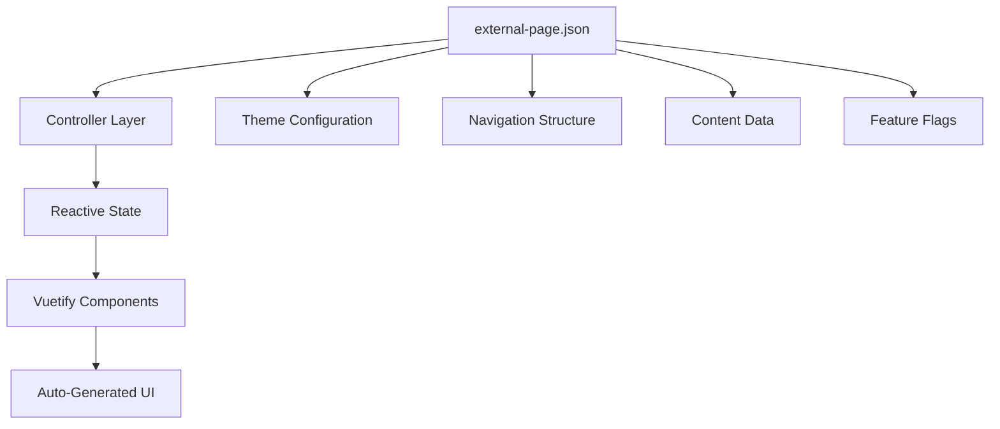

# 🚀 Vue 3 + Vuetify + Supabase Thesis Template

<div align="center">


### 🎯 **Zero-Config Auto-Layout Wrapper for Cross-Platform Development**

*Automate your layout phase by simply configuring JSON - No manual component wiring needed!*

[](https://codespaces.new/centmarde/thesis-template-web-reusable?quickstart=1)
[](https://vercel.com/new/clone?repository-url=https://github.com/centmarde/thesis-template-web-reusable)

</div>

---

## ✨ **What Makes This Special?**

This is a **data-driven, configuration-first** Vue 3 application that eliminates the tedious layout development phase. Instead of manually coding components and layouts, you simply update `external-page.json` and watch your application transform automatically.

### 🎨 **Key Innovation: JSON-Driven UI**
```json
{
  "title": "Your App Title",
  "features": [...],
  "navigation": [...],
  "theme": { "primary": "#1976D2" }
}
```
↓ *Automatically becomes* ↓
```vue
<template>
  <!-- Fully functional, responsive UI components -->
  <v-app>
    <v-navigation-drawer>...</v-navigation-drawer>
    <v-app-bar>{{ data.title }}</v-app-bar>
    <v-main>...</v-main>
  </v-app>
</template>
```

---

## 🛠️ **Tech Stack & Architecture**

<table>
<tr>
<td width="50%">

### **Frontend Core**
- **🖼️ Vue 3** - Composition API with `<script setup>`
- **🎨 Vuetify 3** - Material Design components **(Styling-Only)**
- **📘 TypeScript** - Full type safety with strict config
- **⚡ Vite** - Lightning-fast dev server & builds
- **🍍 Pinia** - Intuitive state management

</td>
<td width="50%">

### **Backend & Services**
- **🚀 Supabase** - Authentication & Database
- **🌐 Axios** - HTTP client for data fetching
- **🔄 Vue Router 4** - File-based auto-routing
- **🎭 Vue Toastification** - Elegant notifications
- **📋 Auto-imports** - Zero-import development

</td>
</tr>
</table>

### **🤖 Zero-Config Automation**
| Plugin | Purpose | Auto-Generated |
|--------|---------|----------------|
| `unplugin-vue-router` | 📁 **File-based routing** | Routes from `src/pages/*.vue` |
| `unplugin-vue-components` | 🔧 **Auto-importing** | Global components from `src/components/` |
| `vite-plugin-vue-layouts-next` | 📐 **Layout system** | Layout wrappers from `src/layouts/` |
| `unplugin-auto-import` | ⚡ **Composables** | Vue/Pinia/Router APIs without imports |
| `unplugin-fonts` | 🔤 **Typography** | Google Fonts auto-loading |

---

## 🏗️ **Data-Driven Architecture**

### **Single Source of Truth: `external-page.json`**


### **Controller Pattern**
```typescript
// src/controller/landingController.ts
export function useLandingController() {
  const data = ref<LandingData | null>(null)
  const loading = ref(false)
  const error = ref<string | null>(null)
  
  const fetchLandingData = async () => {
    const response = await axios.get<LandingData>('/data/external-page.json')
    data.value = response.data
  }
  
  return { data, loading, error, fetchLandingData }
}
```

---

## 🚀 **Quick Start**

### **Prerequisites**
- Node.js 18+ 
- npm/yarn/pnpm

### **Installation**
```bash
# Clone the repository
git clone https://github.com/centmarde/thesis-template-web-reusable.git
cd thesis-template-web-reusable

# Install dependencies
npm install

# Start development server
npm run dev
```

### **Customize Your App**
1. **📝 Edit Configuration**: Modify `public/data/external-page.json`
2. **🎨 Adjust Theme**: Update theme colors in the JSON
3. **📄 Add Pages**: Create `.vue` files in `src/pages/` (auto-routed)
4. **🧩 Add Components**: Drop components in `src/components/` (auto-imported)

---

## 📁 **Project Structure**

```
src/
├── 📱 components/
│   ├── auth/           # Authentication components
│   ├── common/         # Shared UI components
│   └── [feature]/      # Feature-specific components
├── 🎛️ controller/      # Data fetching & state management
├── 📄 pages/           # Auto-routed page components
├── 🗃️ stores/          # Pinia state stores
├── 🎨 layouts/         # Layout wrapper components
├── 🔧 plugins/         # Vue plugin configurations
└── 📚 lib/             # Utility libraries & services

public/
└── 📊 data/
    └── external-page.json  # 🎯 Main configuration file
```

---

## 💡 **Core Philosophy**

### **🎯 Configuration Over Code**
- **Data-Driven**: UI derives from JSON configuration
- **Zero Manual Wiring**: Components auto-connect to data
- **Rapid Prototyping**: Change JSON, see instant results

### **🎨 Vuetify-First Styling**
- **Component-Based**: No custom CSS classes
- **Design System**: Consistent Material Design
- **Responsive**: Built-in breakpoint handling

### **🔄 MCP-Enhanced Development**
- **Vuetify MCP**: Component API documentation
- **Context7**: External library references  
- **Sequential Thinking**: Complex problem solving
- **Playwright**: Automated UI testing

---

## 🤝 **Contributing & Recommendations**

We welcome contributions and recommendations! This project is designed to:

- **🚀 Accelerate development** by eliminating boilerplate
- **📱 Support cross-platform** deployment (Web, PWA, Mobile)
- **🔧 Simplify maintenance** through configuration-driven updates
- **📈 Scale efficiently** with modern Vue 3 patterns

### **Contribution Areas**
- 🎨 **UI Components**: New Vuetify component patterns
- 📊 **Data Schemas**: Enhanced JSON configuration options
- 🔌 **Integrations**: Additional service integrations
- 📱 **Platform Support**: Mobile/desktop optimizations
- 📚 **Documentation**: Usage examples and tutorials

---

## 📄 **License**

This project is open source and available under the [MIT License](LICENSE).

---

<div align="center">

**🌟 Star this repo if it helps accelerate your development workflow!**

[🐛 Report Bug](https://github.com/centmarde/thesis-template-web-reusable/issues) • [💡 Request Feature](https://github.com/centmarde/thesis-template-web-reusable/issues) • [💬 Discussions](https://github.com/centmarde/thesis-template-web-reusable/discussions)

</div>